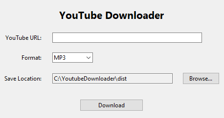

# YouTube MP3/MP4 Downloader

A Windows desktop app that downloads YouTube videos or extracts audio as MP3 – **no ffmpeg required**. Built in Python using **Tkinter** for a simple GUI, packaged as a single `.exe` with [PyInstaller](https://www.pyinstaller.org/).

## Table of Contents

- [Features](#features)  
- [Screenshots](#screenshots)  
- [How It Works](#how-it-works)  
- [Usage](#usage)  
  - [Running the Source Python Script](#running-the-source-python-script)  
  - [Using the Standalone EXE](#using-the-standalone-exe)  
- [Settings Persistence](#settings-persistence)  
- [Building the EXE](#building-the-exe)  
  - [Dependencies](#dependencies)  
  - [PyInstaller Command](#pyinstaller-command)  
  - [Common Issues](#common-issues)  
- [Security & Antivirus Warnings](#security--antivirus-warnings)  
- [License](#license)

---

## Features

1. **Download Videos** as MP4 in the highest available resolution.  
2. **Extract Audio** as MP3 by simply renaming the audio-only file (no ffmpeg needed).  
3. **Remembers Download Folder** across sessions (stores `settings.json` next to the `.exe` or in the script directory).  
4. **Simple GUI**
5. **Packaged as a Single Executable** using PyInstaller, so you can run it on most Windows machines without installing Python.

---

## Screenshots

<p align="center">
  
</p>

---

## How It Works

1. **User enters a YouTube URL** and selects a download format (MP4 or MP3).  
2. **App fetches metadata** via [`pytubefix`](#) (a forked or local version of PyTube).  
3. **MP4 Download**: The highest-resolution video+audio stream is saved.  
4. **MP3 Download**: An audio-only stream is downloaded, then the file extension is renamed from `.mp4` (or `.m4a`) to `.mp3`.  
   - *(In most media players, this is enough to play the track. If you need a true MP3 container, consider using ffmpeg to convert instead.)*

---

## Usage

### Running the Source Python Script

1. **Clone** this repository or download the files to your local machine.  
2. **Install dependencies** (preferably in a virtual environment):
   ```bash
   pip install -r requirements.txt
3. **Run** the app from the command line:
   ```bash
   python download.py
   ```

### Using the Standalone EXE
1. **Navigate** to the `dist/` folder – that’s where PyInstaller places the final `.exe`.  
2. Locate **`GetSongs.exe`** (or whatever name you gave it).  
3. **Double-click** the `.exe` to launch the GUI.  
4. **Enter** your YouTube URL, pick **MP4** or **MP3**, optionally choose a download folder, and **Download**.  
5. On the first run, a `settings.json` file is created next to the `.exe` to remember your chosen folder on future launches.

> **Tip**: Place `GetSongs.exe` somewhere you have write access, so it can store `settings.json` and download files.

---

## Settings Persistence

- The application saves your chosen download folder in a `settings.json` file located **next to** the `.exe` (or near `download.py` if running from source).  
- If no `settings.json` exists, the current working directory is used by default.  
- Once you pick a folder, that folder is saved so you don’t have to select it again later.  
- **Reset** by deleting `settings.json`, which makes the app default to the current directory again.

---

## Building the EXE

### Dependencies

- **Python 3.9+** (or your current Python version)  
- **PyInstaller**:
  ```bash
  pip install pyinstaller
- **pytubefix** (your custom or local fork of PyTube)  
- **Optional**: `.ico` file (such as `dj.ico`) for the application/window icon.

### PyInstaller Command
A typical command to produce a single-file `.exe`:

```bash
pyinstaller --onefile --noconsole \
    --add-data "assets\\dj.ico;." \
    --icon "assets\\dj.ico" \
    --name "GetSongs" \
    download.py
```

### Common Issues

1. **Antivirus False Positives**  
   Newly generated PyInstaller executables can be flagged by AV or SmartScreen. See [Security & Antivirus Warnings](#security--antivirus-warnings).

2. **Invalid `.ico` File**  
   If `dj.ico` is corrupt or not a proper icon file, PyInstaller might fail to embed it. Test it first in a regular Python script with:
   ```python
   root.iconbitmap("dj.ico")
   ```

### Permission Errors
If you place the `.exe` in a folder you don’t have permission to write to (like `Program Files`), it can’t create `settings.json` or download files. Choose a user-writable folder (for example, Desktop or Documents).

### `pytubefix` Not Found
Ensure `pytubefix` is in your Python environment so PyInstaller can include it. If it’s a local file, try `--paths=.` or place it in `site-packages`.

---

## Security & Antivirus Warnings

**Why might Windows warn about this `.exe`?**  
PyInstaller executables are sometimes flagged by heuristic-based AVs or SmartScreen, especially if they’re unsigned and newly created.

**Possible Solutions**:  
1. **Code-Sign** your `.exe` if you plan to distribute widely in a professional context.  
2. **Rename** your `.exe` if it has a generic or suspicious name like “download.exe.”  
3. **Whitelist** or **Allow** the `.exe` in your antivirus if it’s for personal use.  
4. **Use an Installer** (Inno Setup, NSIS) to provide a more standard installation flow, which can reduce false positives.

---

## License

```java
MIT License
Permission is hereby granted, free of charge, to any person obtaining a copy
of this software and associated documentation files
```